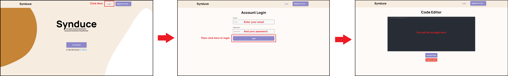

# Synduce-app
A frontend and backend service architecture for [Synduce](https://github.com/synduce/Synduce). Made by Makan, Vedang, Daniel, Asad, and Aarya for CSC301 at the University of Toronto.

## Description

Sometimes using a command line interface is not so friendly. It can be very unintuitive to use or can be a very boring wall of text to look at. Our web application is a tool enabling you to interface with the Synduce application online with a much friendlier interface. You can write OCaml scripts in the built-in text editor. Once you are done, you can execute Synduce to begin synthesizing your code and the application will run in the cloud. Once it has run it will return the log output. Our product gives ease of mind to users. They do not have to look at a command line and they have the convenience of running Synduce online without building it manually. Plus, they have added conveniences like ability to create accounts, save code online, etc.

## Instructions

First a user will need to go into an internet browser of their choice and type in the URL of the application. Refer to the end of the document for the link to the web application. They will then land on the home page:

Upon landing on the homepage, a user will have 3 main options:

1. Log in as an existing user: If a user already has an account with us, they can login to it from the homepage. Once logged in, they will be brought to the code-editor page. 

2. Register for an account: If a user wishes to register for an account, they can do so by clicking the 'Register' button at the top right of the homepage. There, they can enter their email and password to create an account. Once registered, they will be logged in and redirected back to the code editor page.

3. Use as a guest: If users simply wish to test Synduce without signing up, they can proceed directly to the code editor page via the 'Try It Now' button on the homepage.

Once at the code editor, a user can type code into it and submit the job to Synduce via the 'Execute Code' button. Synduce could take up to 15 minutes to return an answer, so users are free to close the tab, refresh the page, or log out. Once the job finishes, the results will be displayed under the code editor. If the job still hasn't finished, users can click the 'Request Update' button to manually ask the backend for the job's status.

Buttons for navigation can be found in the Nav Bar at all times. A logged in user will be able to see their profile and log out from here, while a guest/non-logged-in user will have the option to Register or Login from there. The 'Synduce' logo on the top left will bring one back to the homepage.

Here is the navigation bar for a user that has logged in:

Here is what it would like to a guest user.

As mentioned a user with an account can also update profile information by clicking on their email in the navigation bar. They will be brought to the profile page. Once there, they can update their profile information as they wish.

## Development requirements

### Frontend
You must already have `npm` installed and working on your system. In the `frontend` directory, you can run `npm start` to start the app in the development server. Visit [http://localhost:3000](http://localhost:3000) to view it in the browser.

### Backend
Our backend utilizes a number of AWS services like Lambda, DynamoDB, etc. We use Terraform to automatically set these up and version them. First, set up Terraform with your AWS account credentials. Then, run `terraform init` followed by `terraform apply` inside the `deploy` directory (more information for how to use and set up Terraform can be found [here](https://learn.hashicorp.com/collections/terraform/aws-get-started)). This will create the various AWS resources and permissions. To populate these, manually run the GitHub Actions script `deploy_backend.yml`, replacing the Secrets in this repository with your own credentials. After around 15 minutes, all services will be deployed. **NOTE**: You will incur a small charge of around 5-10 cents on your AWS Account due to our use of Elastic Container Repository.

We also use Firebase for our authentication needs. In order to have this set up you will need to make a Firebase Project available from the Firebase Console. Steps to set up an application with Firbase are available [here](https://firebase.google.com/docs/web/setup). For the Synduce web application, this is already setup, however you can make reset it if you like. Importantly, the configuration file is what you need to update if you are reseting the Firebase project. The configuration file is located in `frontend/src/libs/firebase/FireBaseConfig.js`. More information for how to set that up are avaliable at the [website](https://firebase.google.com/docs/web/setup) we mentioned earlier. 

## Deployment

This application has separate frontend and backend components. The backend is hosted completely on AWS while the frontend is hosted on Heroku. GitHub Actions handle automated deployment to both of these services.

The Actions script `deploy_backend.yml` handles deploying our code to AWS. Specifically: 
1. It downloads all npm dependencies for four of our five Lambda functions and then zips them up to prepare for pushing to AWS.
2. It builds and tags a Docker image for our fifth container-backed Lambda.
3. It deploys each of the zipped payloads to the first four Lambdas via the AWS CLI.
4. It pushes the tagged container image to AWS ECR via the AWS CLI, then redeploys the fourth Lambda.

The Actions script `deploy_frontend.yml` handles deploying our frontend code to Heroku. This involved compiling our React application into a static site and then pushing it to Heroku.

Both scripts use credentials stored in this repository's Secrets to ensure that no confidential information is exposed. The following Secrets are required:
* AWS_ACCESS_KEY_ID: The programmatic access key for the host AWS account. Follow the instructions [here](https://docs.aws.amazon.com/IAM/latest/UserGuide/id_credentials_access-keys.html#Using_CreateAccessKey) to make one.
* AWS_SECRET_ACCESS_KEY: The programmatic secret access key for the host AWS account. This will be obtained along with the access key in the previous step.
* HEROKU_API_KEY: The API key for the host Heroku account.
* HEROKU_EMAIL: The email address of the host Heroku account.
* ROLE_TO_ASSUME: The ARN (Amazon Resource Number) of the Role on AWS to run the Actions under. This Role will be automatically created by Terraform on initialization. Please copy this value by going to `IAM -> Roles -> RoleForGithubActionsUploadToLambda`.
