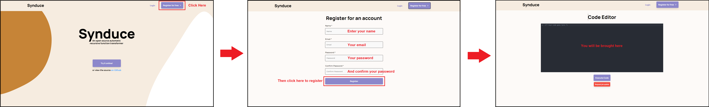
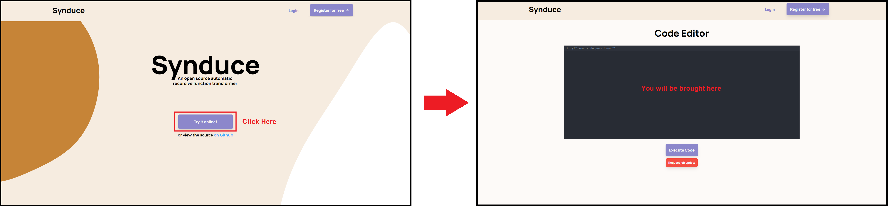
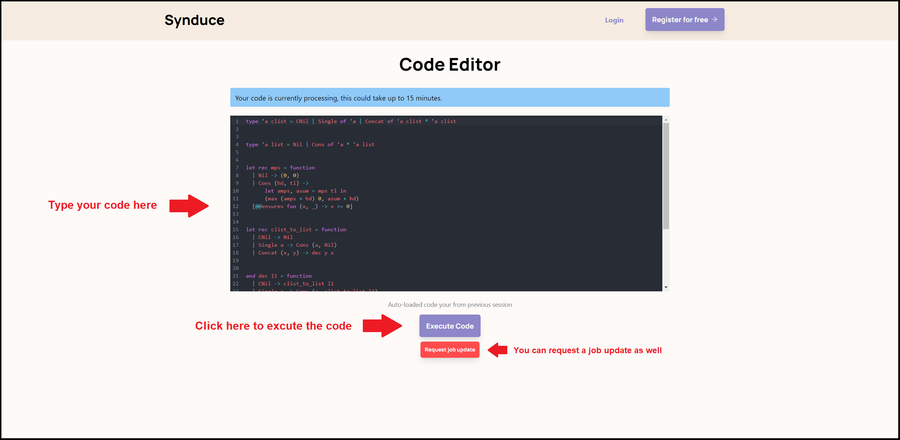
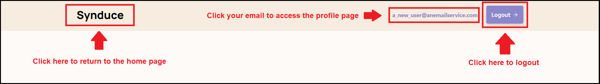
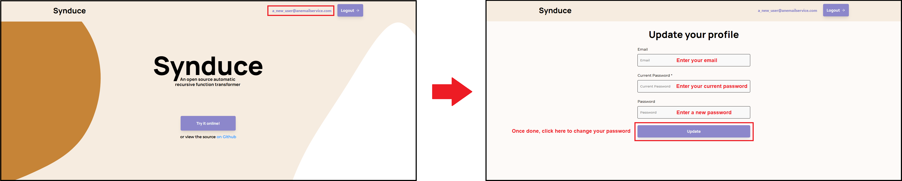

# Synduce / 6 Devs 1 App

## Description 
 * Provide a high-level description of your application and it's value from an end-user's perspective
 * What is the problem you're trying to solve?
 * Is there any context required to understand **why** the application solves this problem?

Sometimes using a command line interface is not so friendly. It can be very unintuitive to use or can be a very boring wall of text to look at. Our web application is a tool enabling you to interface with the Synduce application online with a much friendlier interface. You can write OCaml scripts in the built-in text editor. Once you are done, you can execute Synduce to begin synthesizing your code and the application will run in the cloud. Once it has run it will return the log output. Our product gives ease of mind to any user. They do not have to look at a command line and they have the convenience of running Synduce online with the ability to create accounts as well.

## Key Features
 * Described the key features in the application that the user can access
 * Provide a breakdown or detail for each feature that is most appropriate for your application
 * This section will be used to assess the value of the features built

There were a few features that we were able to get working for this iteration.

Firstly we have the code editor. A user can access the code editor from the home page either as an existing user or they can use it as a guest. Once on the editor page, they can begin typing in OCaml scripts that will be sent to Synduce once done. For added convenience we incorporated an OCaml syntax highlighter and made it a dark mode editor to go easy on the eyes.

Next, we have the login page. Here users that have already created an account with Synduce can login, authenticate their account, and continue to the code editor to begin coding.

Thirdly, a user can access their profile page. Once a user has logged in, they can view their profile page and edit the accounts email address and update the password if they like. 

Lastly, the main purpose of this application is to allow you to run Synduce, and this is done at the click of a button on the code editor page. Once you are satisfied with your code snippet you can submit the job to be done in the cloud for up to 15 minutes. Synduce will then synthesize your code, and once it has completed it will return to you the log output from Synduce. Our partners have attested that the log output that we have is sufficient and is functional enough to understand what Synduce is doing. The log output is nearly identical to the command line output and it only lacks terminal colouring. You can also check and update the job status also done through a button on the code editor page.

## Instructions
 * Clear instructions for how to use the application from the end-user's perspective
 * How do you access it? Are accounts pre-created or does
  a user register? Where do you start? etc. 
 * Provide clear steps for using each feature described above
 * This section is critical to testing your application and must be done carefully and thoughtfully

First a user will need to go into an internet browser of their choice and type in the URL of the application. Refer to the end of the document for the link to the web application. They will then land on the home page:

Upon landing on the homepage, a user will have 3 main options:

1. Log in as an existing user: If a user already has an account with us, they can login to it from the homepage. Once logged in, they will be brought to the code-editor page. 

2. Register for an account: If a user wishes to register for an account, they can do so by clicking the 'Register' button at the top right of the homepage. There, they can enter their email and password to create an account. Once registered, they will be logged in and redirected back to the code editor page.

3. Use as a guest: If users simply wish to test Synduce without signing up, they can proceed directly to the code editor page via the 'Try It Now' button on the homepage.

Once at the code editor, a user can type code into it and submit the job to Synduce via the 'Execute Code' button. Synduce could take up to 15 minutes to return an answer, so users are free to close the tab, refresh the page, or log out. Once the job finishes, the results will be displayed under the code editor. If the job still hasn't finished, users can click the 'Request Update' button to manually ask the backend for the job's status.

Buttons for navigation can be found in the Nav Bar at all times. A logged in user will be able to see their profile and log out from here, while a guest/non-logged-in user will have the option to Register or Login from there. The 'Synduce' logo on the top left will bring one back to the homepage.

Here is the navigation bar for a user that has logged in:

Here is what it would like to a guest user.

As mentioned a user with an account can also update profile information by clicking on their email in the navigation bar. They will be brought to the profile page. Once there, they can update their profile information as they wish.

## Development requirements
 * If a developer were to set this up on their machine or a remote server, what are the technical requirements (e.g. OS, libraries, etc.)?
 * Briefly describe instructions for setting up and running the application (think a true README).

You must already have npm installed and working on your system.
In the project directory, you can run:

### `npm start`

Runs the app in the development mode. 
Open [http://localhost:3000](http://localhost:3000) to view it in the browser.

The page will reload if you make edits. 
You will also see any lint errors in the console.

### `npm test`

Launches the test runner in the interactive watch mode. 
See the section about [running tests](https://facebook.github.io/create-react-app/docs/running-tests) for more information.

## Deployment and Github Workflow

Describe your Git / GitHub workflow. Essentially, we want to understand how your team members shares a codebase, avoid conflicts and deploys the application.

 * Be concise, yet precise. For example, "we use pull-requests" is not a precise statement since it leaves too many open questions - Pull-requests from where to where? Who reviews the pull-requests? Who is responsible for merging them? etc.
 * If applicable, specify any naming conventions or standards you decide to adopt.
 * Describe your overall deployment process from writing code to viewing a live applicatioon
 * What deployment tool(s) are you using and how
 * Don't forget to **briefly explain why** you chose this workflow or particular aspects of it!

### GitHub Workflow

The first step is for each team member to decide what part of the application they want to work on. Once this is finalized, members create branches for their tasks and develop there. During this process, members use the team Discord server to coordinate, get clarifications, vote on design decisions, etc.

When their work is ready to be merged, members create a pull request back to the main branch. The requester asks those most likely to be affected by the changes to review the PR. Once all parties have agreed to the changes, the request is merged and that branch deleted.

For development on the GitHub Actions scripts specifically, members fork the repo into their own account instead of making a branch. This ensures that Actions which take a long time to run do not use up the organization's Actions limit. A cross-repo PR is made when these changes are done. From here, the process is the same as above.

### Deployment

This application has separate frontend and backend components. The backend is hosted completely on AWS while the frontend is hosted on Heroku. GitHub Actions handle automated deployment to both of these services.

The Actions script `deploy_backend.yml` handles deploying our code to AWS. Specifically: 
1. It downloads all npm dependencies for three of our four Lambda functions and then zips them up to prepare for pushing to AWS.
2. It builds and tags a Docker image for our fourth container-backed Lambda.
3. It deploys each of the zipped payloads to the first three Lambdas via the AWS CLI.
4. It pushes the tagged container image to AWS ECR via the AWS CLI, then redeploys the fourth Lambda.

The Actions script `deploy_frontend.yml` handles deploying our frontend code to Heroku. This involved compiling our React application into a static site and then pushing it to Heroku.

Both scripts use credentials stored in this repository's Secrets to ensure that no confidential information is exposed.

We decided to use GitHub Actions since our team members had prior experience working with it and because they already come packaged with all the tools we need like the AWS and Heroku CLIs, support for safely using credentials, and lots of offical and community Actions.

## Licenses 

 Keep this section as brief as possible. You may read this [Github article](https://help.github.com/en/github/creating-cloning-and-archiving-repositories/licensing-a-repository) for a start.

 * What type of license will you apply to your codebase?
 * What affect does it have on the development and use of your codebase?
 * Why did you or your partner make this choice?

We will be using an MIT license. The choice of license allows our users to easily see the source code, copy it, make their own modifications, etc. Our partners were OK with us making this project open source, and since Synduce is already open source and under a MIT licence, we decided to go with it as well.

## Link to Application

[Synduce](https://synduce.herokuapp.com/)
